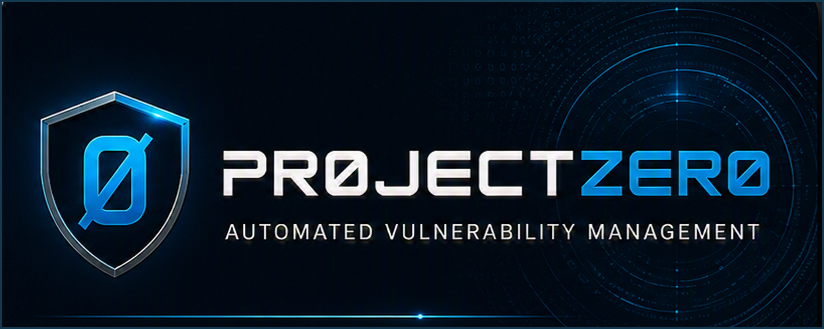
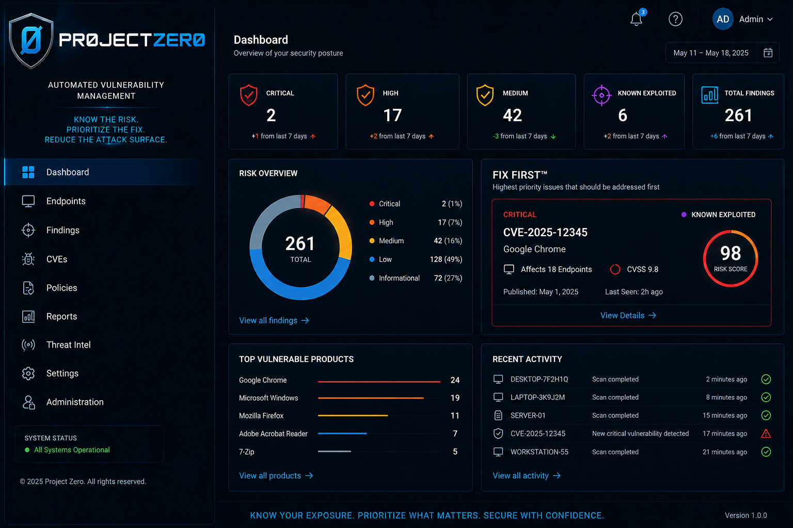

<p align="center">
  
</p>

<p align="center">
  
  
  
  
</p>

# Pr0jectZer0

## Light weight Cyber Exposure Management Platform

> **Know Your Exposure. Prioritize What Matters. Secure with Confidence.**

Pr0jectZer0 is a privacy-first exposure management platform designed to help small and midsize organizations identify endpoint vulnerabilities, understand what matters most, and focus remediation effort through **Fix First™** prioritization.

This repository is the official public product and documentation repository. It intentionally contains **no application source code**. Active development is maintained in a separate private repository.

## What Pr0jectZer0 Does

- Maintains local endpoint and software inventory
- Synchronizes vulnerability intelligence
- Resolves software products to standardized identifiers
- Correlates installed versions with known vulnerabilities
- Enriches risk with CISA Known Exploited Vulnerabilities context
- Persists actionable findings
- Prioritizes the highest-impact remediation work through **Fix First™**
- Presents exposure through a purpose-built management dashboard

## Privacy by Design

Customer security data remains inside the customer's environment.

Pr0jectZer0's planned licensing service will receive only the minimum operational metadata required to validate a subscription:

- Anonymous server identifier
- Product version
- Endpoint count
- Subscription status

It is intentionally designed not to receive vulnerability findings, software inventory, endpoint names, usernames, IP addresses, customer files, or scan results.

See [Privacy Architecture](docs/PRIVACY_ARCHITECTURE.md).

## Product Direction

Pr0jectZer0 is being developed as a native Windows platform for organizations that want a straightforward, set-it-and-forget-it exposure management experience without requiring Docker or development tooling on customer systems.

### Core principles

- **Privacy first** — Security data stays local.
- **Actionable** — Prioritize what should be fixed first.
- **Windows native** — Simple deployment and operation.
- **Lightweight** — Focused architecture without unnecessary platform sprawl.
- **SMB friendly** — Designed for organizations without a large security team.
- **Commercial-quality UX** — Clear, polished information for technical and executive users.

## Dashboard Direction

<p align="center">
  
</p>

The visual direction uses a deep navy and graphite interface with restrained electric-blue accents, clear risk signaling, and a prominent **Fix First™** workflow.

## High-Level Architecture

```text
Windows Endpoints
       │
       │ secure check-in and inventory
       ▼
Pr0jectZer0 On-Premises Server
       ├── Endpoint inventory
       ├── Vulnerability intelligence
       ├── Product and version correlation
       ├── Findings persistence
       ├── Risk prioritization
       └── Management dashboard

Future privacy-preserving cloud service
       ├── License validation
       ├── Subscription status
       ├── Product version
       └── Endpoint count only
```

Implementation details, source code, internal APIs, database schemas, matching logic, and proprietary scoring internals are not published in this repository.

## Roadmap

The current roadmap includes:

1. Core product stabilization, Findings API and dashboard completion, enterprise UI, Git cleanup, and production hardening
2. Threat Intelligence Library
3. Public release preparation
4. Native Windows platform
5. Pilot deployment
6. Commercial one-click installer and enrollment
7. Privacy-preserving cloud licensing platform

See the full [Product Roadmap](ROADMAP.md).

## Repository Policy

This repository may contain:

- Public documentation
- Product screenshots and design concepts
- Public roadmap information
- Release notes
- Security reporting information
- Privacy and architecture summaries

This repository does **not** contain:

- Application source code
- Build scripts for proprietary software
- Internal database schemas
- Private implementation documentation
- Credentials, tokens, or customer information
- Proprietary matching or scoring logic

## Status

Pr0jectZer0 is under active development and is not currently represented as generally available or production-supported. Features, architecture, screenshots, pricing, and timelines may change during development.

## Website and Contact

- Product website: **https://pr0jectzer0.com**
- General and security contact: **info@thebostromgroup.com**

## Legal

Pr0jectZer0, Fix First™, related branding, product concepts, documentation, and unpublished implementation materials are proprietary. See [LICENSE.md](LICENSE.md) and [NOTICE.md](NOTICE.md). Product of The Bostrom Group 2026 all rights reserved
