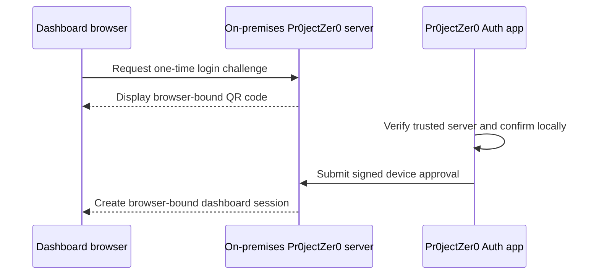
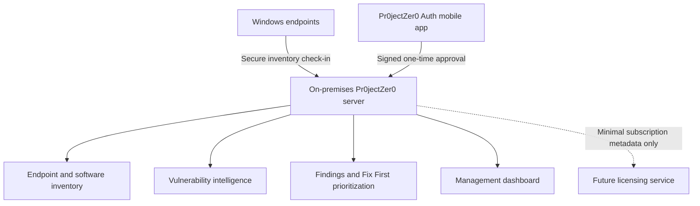

  

  
  
  
  

# Pr0jectZer0

## Lightweight Cyber Exposure Management Platform

> **Know Your Exposure. Prioritize What Matters. Secure with Confidence.**

Pr0jectZer0 is a privacy-first exposure management platform designed to help small and midsize organizations identify endpoint vulnerabilities, understand what matters most, and focus remediation through **Fix First™** prioritization.

This is the official public product-showcase repository. It intentionally contains **no application source code**. Active development is maintained privately.

## What Pr0jectZer0 Does

- Maintains local endpoint and software inventory
- Synchronizes vulnerability intelligence
- Correlates installed products and versions with known vulnerabilities
- Enriches risk with CISA Known Exploited Vulnerabilities context
- Persists actionable findings inside the customer environment
- Prioritizes high-impact remediation through **Fix First™**
- Presents exposure through a purpose-built management dashboard
- Protects dashboard access with registered-device approval

## Registered-Device Dashboard Login

Pr0jectZer0 now supports a working passwordless dashboard handoff using the companion [Pr0jectZer0 Auth](https://github.com/TBG-Chance/Pr0jectZer0-Auth) mobile app.

The user confirms on the phone with biometrics or an app-local PIN. Biometric data, the local PIN, and the device private key remain on the phone. The QR code alone cannot claim the resulting browser session.

See the public [Authentication Architecture](docs/AUTHENTICATION.md) and the companion [Auth showcase](https://github.com/TBG-Chance/Pr0jectZer0-Auth).

## Privacy by Design

Customer security data remains inside the customer's environment. Pr0jectZer0 is designed so a future licensing service receives only the minimum operational metadata required to validate a subscription, such as an anonymous server identifier, product version, endpoint count, and subscription status.

It is not designed to receive vulnerability findings, software inventory, endpoint names, usernames, IP addresses, customer files, or scan results.

See [Privacy Architecture](docs/PRIVACY_ARCHITECTURE.md).

## Product Direction

Pr0jectZer0 is being developed toward a native Windows experience for organizations that want straightforward, set-it-and-forget-it exposure management without requiring development tooling.

### Core principles

- **Privacy first** — Security data stays local.
- **Actionable** — Prioritize what should be fixed first.
- **Secure access** — Require trusted-device approval for dashboard sessions.
- **Windows native** — Keep deployment and operation straightforward.
- **Lightweight** — Avoid unnecessary platform sprawl.
- **SMB friendly** — Serve organizations without a large security team.
- **Commercial-quality UX** — Present information clearly to technical and executive users.

## Dashboard

  

The visual system uses deep navy and graphite surfaces, restrained electric-blue accents, clear risk signaling, and a prominent **Fix First™** workflow.

## High-Level Architecture

Implementation details, source code, internal APIs, database schemas, matching logic, and proprietary scoring internals are not published here.

## Current Development Milestone

The current private development build has validated:

- Mobile-device enrollment against a local Pr0jectZer0 server
- Physical Android device operation
- Biometric confirmation with app-local PIN fallback
- Device-bound signed login approval
- Browser-bound, single-use dashboard session creation
- Local trusted-device state and status presentation

This milestone is a development preview, not a generally available release or security certification.

## Roadmap

The roadmap covers core stabilization, threat-intelligence improvements, native Windows packaging, controlled pilots, commercial installation, and privacy-preserving licensing. See the full [Product Roadmap](ROADMAP.md).

## Repository Policy

This repository may contain public documentation, screenshots, design concepts, roadmap information, release notes, security-reporting guidance, and high-level architecture summaries.

It does **not** contain application source code, proprietary build systems, internal schemas, credentials, customer information, matching algorithms, or scoring formulas.

## Status

Pr0jectZer0 is under active development and is not currently represented as generally available or production-supported. Features, architecture, screenshots, pricing, and timelines may change.

## Website and Contact

- Product website: [pr0jectzer0.com](https://pr0jectzer0.com)
- General and security contact: **info@thebostromgroup.com**

## Legal

Pr0jectZer0, Pr0jectZer0 Auth, Fix First™, related branding, product concepts, documentation, and unpublished implementation materials are proprietary. See [LICENSE.md](LICENSE.md) and [NOTICE.md](NOTICE.md).

Copyright © 2026 The Bostrom Group. All rights reserved.
