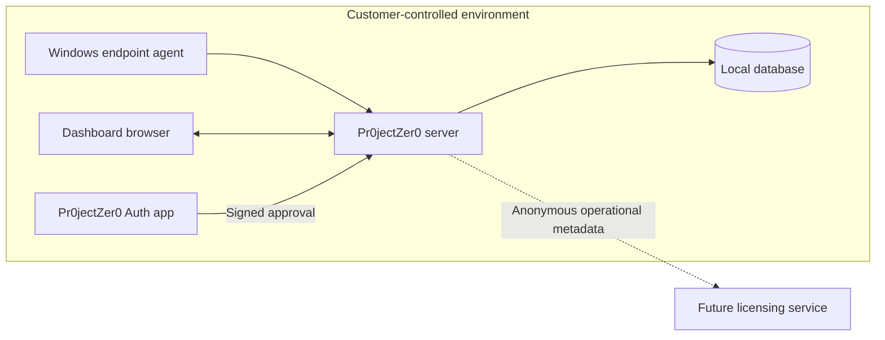

# Public Architecture Overview

This document describes Pr0jectZer0 at a deliberately high level. It does not disclose proprietary matching logic, scoring formulas, schemas, internal endpoints, or implementation details.

## Customer Deployment Boundary

### Windows Endpoint Agent

- Collects approved local inventory
- Registers with the local Pr0jectZer0 server
- Receives local policy and rescan instructions
- Does not send customer inventory to a licensing service

### Pr0jectZer0 Server

- Accepts endpoint check-ins
- Stores endpoint and software inventory
- Synchronizes vulnerability intelligence
- Normalizes products and versions
- Correlates installed software with affected versions
- Scores and persists findings
- Serves the management dashboard
- Coordinates registered-device authentication

### Local Database

Stores the operational data required by the customer's deployment, including devices, software, vulnerability intelligence, findings, policies, authentication state, and synchronization state.

### Pr0jectZer0 Auth

The companion mobile app enrolls once with a trusted local server. It holds a device signing identity in platform-protected storage and confirms dashboard login requests locally with biometrics or an app-local PIN.

The server accepts a signed, short-lived approval and creates a session only for the browser that initiated the challenge.

## Architecture Summary

## Future External Services

### Threat Intelligence Distribution

May distribute normalization mappings, resolver heuristics, enrichment data, and signed intelligence updates without receiving customer findings.

### Licensing Platform

May validate subscriptions using only anonymous operational metadata such as product version and endpoint count.

## Security Boundary

Customer vulnerability, endpoint, software, findings, and authentication data remain within the customer-controlled deployment boundary. See [Authentication Architecture](AUTHENTICATION.md) and [Privacy Architecture](PRIVACY_ARCHITECTURE.md).
